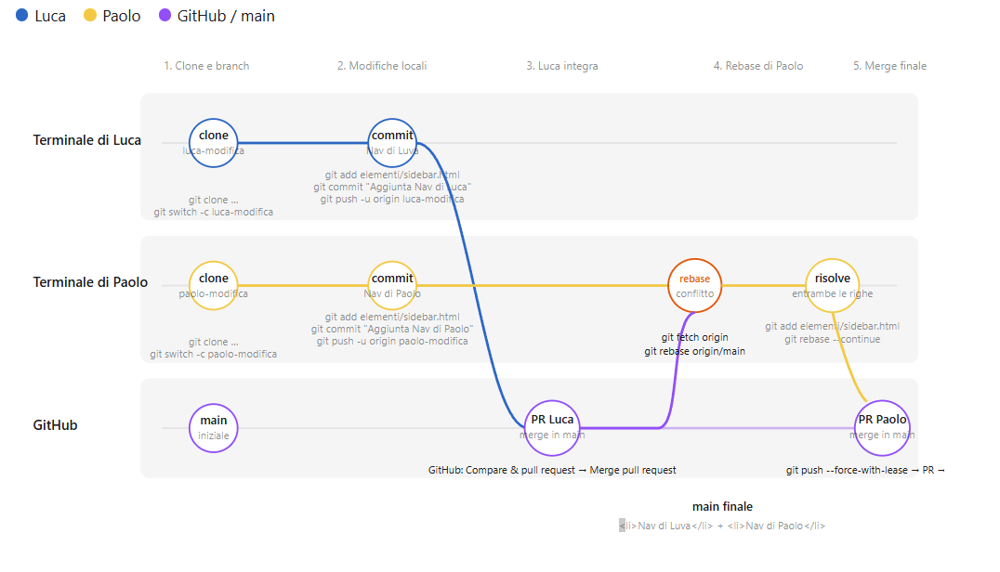

# Guida Git: Gestire modifiche concorrenti con Git

Scenario: Luca e Paolo modificano la stessa riga di `elementi/sidebar.html`

Repository: `https://github.com/rcarvello/Git-Tutorial.git`

Obiettivo finale in `main`:

```html
<li>Nav di Luva</li>
<li>Nav di Paolo</li>
```

Luca e Paolo lavorano su due computer diversi, ciascuno con il proprio clone. Non devono mai usare lo stesso branch.

## 1. Clonazione iniziale

### Terminale di Luca

```bash
git clone https://github.com/rcarvello/Git-Tutorial.git
cd Git-Tutorial
git switch -c luca-modifica
```

### Terminale di Paolo

```bash
git clone https://github.com/rcarvello/Git-Tutorial.git
cd Git-Tutorial
git switch -c paolo-modifica
```

A questo punto la situazione è:

```text
GitHub:                  main
Computer di Luca:        luca-modifica
Computer di Paolo:       paolo-modifica
```

Entrambi i branch personali derivano dallo stesso `main` iniziale.

## 2. Luca modifica la sidebar

### Terminale / editor di Luca

Luca apre `elementi/sidebar.html` e aggiunge:

```html
<li>Nav di Luva</li>
```

Luca salva il file, controlla la modifica e crea il commit:

```bash
git status
git add elementi/sidebar.html
git commit -m "Aggiunta Nav di Luca"
git push -u origin luca-modifica
```

`-u origin luca-modifica` pubblica il branch di Luca su GitHub e collega il branch locale a quello remoto.

### Azioni su GitHub per Luca

1. Aprire il repository GitHub.
2. GitHub mostra il pulsante **Compare & pull request** per `luca-modifica`.
3. Cliccare il pulsante.
4. Controllare che i selettori siano:

```text
base:    main
compare: luca-modifica
```

5. Inserire un titolo, per esempio: `Aggiunta Nav di Luca`.
6. Cliccare **Create pull request**.
7. Controllare i file nella scheda **Files changed**.
8. Cliccare **Merge pull request**.
9. Cliccare **Confirm merge**.

Ora il branch principale su GitHub contiene la modifica di Luca:

```text
main → <li>Nav di Luva</li>
```

## 3. Paolo modifica localmente la stessa riga

Paolo aveva creato `paolo-modifica` prima che la Pull Request di Luca venisse integrata. Perciò il suo branch locale non contiene ancora la modifica di Luca.

### Terminale / editor di Paolo

Paolo apre `elementi/sidebar.html` e aggiunge sulla stessa zona del file:

```html
<li>Nav di Paolo</li>
```

Poi salva, crea il commit e pubblica il proprio branch:

```bash
git status
git add elementi/sidebar.html
git commit -m "Aggiunta Nav di Paolo"
git push -u origin paolo-modifica
```

Per il momento Paolo non integra la propria Pull Request: prima deve riallineare il suo lavoro all’ultimo `main`, che ora contiene il contributo di Luca.

## 4. Paolo aggiorna il proprio branch usando rebase

### Terminale di Paolo

Paolo rimane sul branch `paolo-modifica` e scarica le informazioni aggiornate da GitHub:

```bash
git fetch origin
```

Poi avvia il rebase:

```bash
git rebase origin/main
```

Git prova a prendere il commit di Paolo e ad applicarlo dopo l’ultimo commit di `main`, dove è già presente Luca.

Poiché entrambi hanno modificato la stessa riga o sezione, Git ferma il rebase e mostra un messaggio simile:

```text
CONFLICT (content): Merge conflict in elementi/sidebar.html
error: could not apply ... Aggiunta Nav di Paolo
```

Questo non è un errore irreparabile: Git sta chiedendo a Paolo di decidere il contenuto finale.

## 5. Paolo risolve il conflitto

### Editor di Paolo

Paolo apre `elementi/sidebar.html`. Git avrà inserito marcatori simili a questi:

```html
<<<<<<< HEAD
<li>Nav di Luva</li>
=======
<li>Nav di Paolo</li>
>>>>>>> Aggiunta Nav di Paolo
```

In questo caso:

- La parte tra `<<<<<<< HEAD` e `=======` è la versione già presente su `main`: la modifica di Luca.
- La parte tra `=======` e `>>>>>>>` è la modifica di Paolo che Git stava tentando di aggiungere.

Paolo sostituisce l’intero blocco con il risultato finale desiderato:

```html
<li>Nav di Luva</li>
<li>Nav di Paolo</li>
```

Deve eliminare completamente le tre righe di controllo Git:

```text
<<<<<<< HEAD
=======
>>>>>>> Aggiunta Nav di Paolo
```

Poi salva il file.

### Terminale di Paolo

Paolo comunica a Git che il conflitto è risolto e prosegue il rebase:

```bash
git add elementi/sidebar.html
git rebase --continue
```

Se Git segnala altri conflitti, Paolo ripete gli stessi passaggi per ciascun file:

1. Aprire il file.
2. Combinare le modifiche.
3. Eliminare i marcatori Git.
4. Salvare.
5. Eseguire `git add nome-file`.
6. Eseguire `git rebase --continue`.

Quando il rebase termina, Paolo può controllare il risultato:

```bash
git status
git diff origin/main -- elementi/sidebar.html
```

## 6. Paolo aggiorna il branch su GitHub

Il rebase ha ricreato il commit di Paolo sopra il nuovo `main`. Per questo il normale `git push` viene rifiutato: GitHub possiede ancora la versione precedente del branch di Paolo.

Paolo pubblica la versione corretta con:

```bash
git push --force-with-lease origin paolo-modifica
```

`--force-with-lease` è adatto in questo caso perché Paolo sta aggiornando il proprio branch personale dopo un rebase. È più sicuro di `--force`: non sovrascrive un eventuale nuovo lavoro remoto che Paolo non abbia ancora scaricato.

## 7. Pull Request di Paolo su GitHub

### Azioni su GitHub per Paolo

1. Aprire il repository GitHub.
2. Cliccare **Compare & pull request** per il branch `paolo-modifica`.
3. Controllare:

```text
base:    main
compare: paolo-modifica
```

4. Aprire la scheda **Files changed**.
5. Verificare che siano presenti entrambe le righe:

```html
<li>Nav di Luva</li>
<li>Nav di Paolo</li>
```

6. Cliccare **Create pull request**.
7. Fare la revisione della Pull Request.
8. Cliccare **Merge pull request**.
9. Cliccare **Confirm merge**.

Ora `main` su GitHub contiene entrambe le modifiche.

## 8. Aggiornamento finale dei due computer

Dopo il merge, Luca e Paolo riallineano il proprio branch `main` locale.

### Terminale di Luca

```bash
git switch main
git pull origin main
```

### Terminale di Paolo

```bash
git switch main
git pull origin main
```

Situazione finale:

```text
GitHub main:             Luca + Paolo
Luca main locale:        Luca + Paolo
Paolo main locale:       Luca + Paolo
```

## Comandi di emergenza durante un rebase

Se Paolo desidera annullare completamente il rebase in corso e tornare alla situazione precedente:

```bash
git rebase --abort
```

Non usare:

```bash
git rebase --skip
```

in questo esempio, perché salterebbe il commit di Paolo e quindi potrebbe eliminare la sua modifica dal risultato finale.

## 9. Grafico del processo di modifica concorrente
### Diagramma di flusso di alto livello

### Diagramma di flusso con comandi Git e azioni su GitHub


